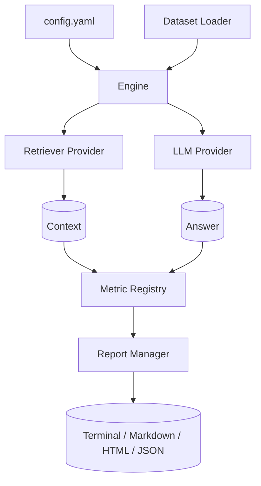

# Architecture

OpenAgent Eval is organized as a modular, pluggable pipeline. This page describes the high-level
design and the responsibilities of each component.

## Design principles

- **Local-first** — everything runs on your machine; no telemetry or required network calls.
- **Configuration-driven** — a single YAML file describes datasets, providers, and metrics.
- **Pluggable** — retrievers, LLMs, metrics, and report formats are interfaces you can implement.
- **Failure-aware** — reports explain *why* an evaluation failed, not just *that* it failed.

## Pipeline overview

## Components

### Configuration (`openagent_eval.config`)

Pydantic-based models validate and load `config.yaml`. The loader resolves dataset specs, provider
settings, and the metric list before anything runs.

### Core orchestration (`openagent_eval.core`)

| Module | Responsibility |
| --- | --- |
| `engine.py` | Top-level entry point that ties everything together |
| `pipeline.py` | Runs retrieval → generation → scoring steps |
| `executor.py` | Executes individual evaluation items |
| `registry.py` | Resolves metric and provider names to implementations |

### Datasets (`openagent_eval.datasets`)

Loaders normalize multiple formats into a common `DatasetItem` model:

- `json_loader` — JSON arrays of question/reference/context
- `jsonl_loader` — newline-delimited JSON
- `csv_loader` — tabular datasets
- `hf_loader` — Hugging Face datasets
- `pdf_loader` — extract questions from PDF documents

### Providers (`openagent_eval.providers`)

Adapters behind stable base classes:

- **LLM** — OpenAI, Google Gemini, Anthropic, Groq, OpenRouter, Ollama
- **Retrievers** — Chroma (more coming soon)
- **Embedders** — provider-specific embedding backends

### Metrics (`openagent_eval.metrics`)

Metrics are grouped by category, each implementing a common `BaseMetric` interface:

- `retrieval` — precision, recall, Recall@K, Precision@K, hit rate, MRR, NDCG
- `generation` — faithfulness, answer relevancy, hallucination, similarity, exact match, F1, BLEU, ROUGE, BERTScore
- `performance` — embedding, retrieval, and LLM latency
- `cost` — token counting and per-provider cost estimation

### Reports (`openagent_eval.reports`)

The `ReportManager` dispatches to format-specific generators: `terminal`, `markdown`, `html`, `json`,
and `comparison` (for `oaeval compare`).

### Plugins (`openagent_eval.plugins`)

A discovery + loader + manager system lets you ship custom metrics, providers, and report formats as
Python packages. See `openagent_eval/plugins/examples/custom_metric.py` for a template.

### CLI (`openagent_eval.cli`)

A [Typer](https://typer.tiangolo.com)-based CLI (`oaeval`) exposes the engine through commands:
`init`, `run`, `report`, `compare`, `list`, and `doctor`.

## Request lifecycle

1. `oaeval run config.yaml` loads and validates the configuration.
2. The dataset loader produces `DatasetItem` objects.
3. For each item, the pipeline retrieves context and generates an answer.
4. Selected metrics score the result.
5. The `ReportManager` persists and renders the report.

## Next steps

- See the [CLI Reference](cli.md) for command details.
- Browse the [API Reference](api.md) for the public interfaces.
- Check the [Roadmap](roadmap.md) for upcoming components.
